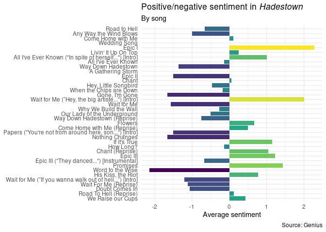
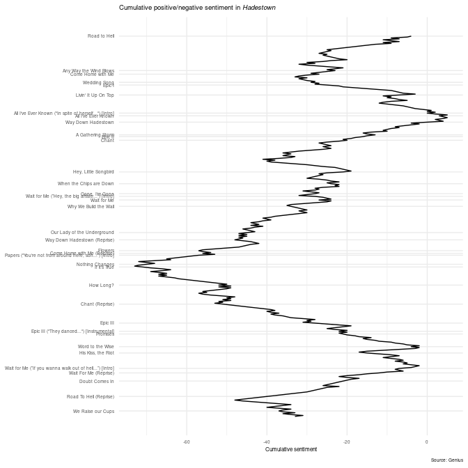
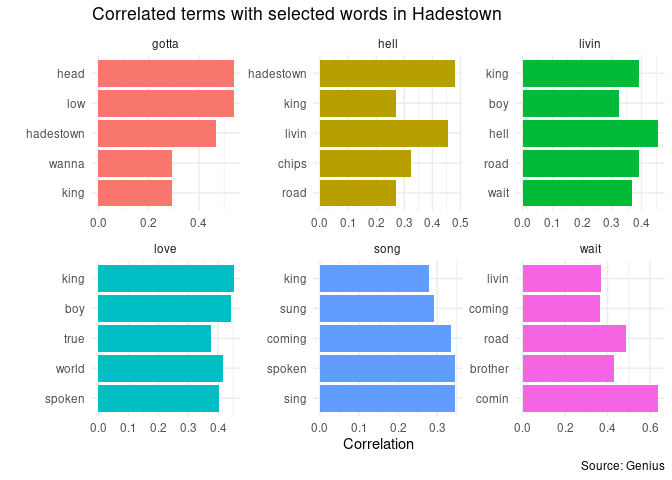
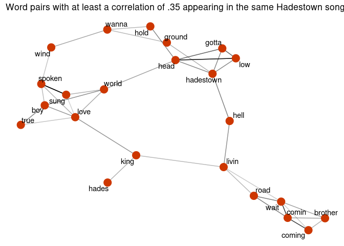
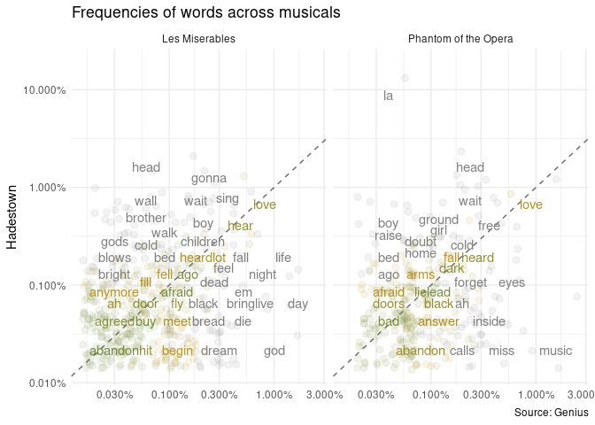

HW09: Analyzing Hadestown lyrics
================
Julia Du
2021-03-13

  - [Load necessary libraries](#load-necessary-libraries)
  - [Overview](#overview)
  - [Get lyric data](#get-lyric-data)
  - [Sentiment analysis](#sentiment-analysis)
  - [Correlated words](#correlated-words)
  - [Comparing word frequencies across
    musicals](#comparing-word-frequencies-across-musicals)
  - [Session info](#session-info)

## Load necessary libraries

``` r
library(tidyverse)
library(genius) #even easier than geniusr
library(scales)

library(tidytext)
library(widyr)
library(ggraph)
library(igraph)

library(viridis)
library(ggtext)
theme_set(theme_minimal())
set.seed(123)
```

## Overview

I’m focusing on the lyrics of the musical *Hadestown* for most of my
analysis, but I bring in *Les Miserables* and *Phantom of the Opera* at
the end to look at common words between those 2 musicals and
*Hadestown*.

I got the data from [Genius.com](https://genius.com) by using a very
helpful package called `genius` (documentation
[here](https://github.com/JosiahParry/genius)), so I didn’t even have to
get an API authentication token like with the `geniusr` package.

My analysis draws heavily from examples in [*Text Mining with
R*](https://www.tidytextmining.com/tidytext.html) and our [class
notes](https://cfss.uchicago.edu/notes/hamilton/#pairs-of-words).

## Get lyric data

``` r
hadestown <- genius_album(artist = "Anais Mitchell", 
                          album = "Hadestown (Original Broadway Cast Recording)")

phantom <- genius_album(artist = "Andrew Lloyd Webber", 
                        album = "The Phantom of the Opera (Original London Cast Recording)")

lesmis <- genius_album(artist = "Les Miserables Original Broadway Cast", 
                       album = "Les Miserables (1987 Original Broadway Cast)")
```

## Sentiment analysis

``` r
tidy_musical <- function(musical_df){
  # keep only song names w/o "by..." info
  clean_track_title <- musical_df %>%
    pull(track_title) %>%
  str_remove(pattern = " by.*")
  
  musical_df %>%
  bind_cols(clean_track_title) %>%
  select(-track_title) %>%
  rename(track_title = ...5) %>%
  mutate(track_title = as_factor(track_title)) %>%
# now tokenize
  unnest_tokens(output = word, input = lyric) %>%
  anti_join(stop_words)
}

hadestown_tidy <- tidy_musical(hadestown)

hadestown_afinn <- hadestown_tidy %>%
  inner_join(get_sentiments(lexicon = "afinn")) %>%
  mutate(cum_sent = cumsum(value), id = row_number())

hadestown_afinn %>%
  group_by(track_title) %>%
  summarize(sent = mean(value)) %>%
  ggplot(mapping = aes(x = fct_rev(track_title), y = sent, fill = sent)) +
  geom_col() +
  scale_fill_viridis_c() +
  coord_flip() +
  labs(
    title = "Positive/negative sentiment in *Hadestown*",
    subtitle = "By song",
    x = NULL,
    y = "Average sentiment",
    fill = "Average\nsentiment",
    caption = "Source: Genius"
  ) +
  theme(plot.title = element_markdown(),
        legend.position = "none")
```

<!-- -->

There are some significant highs and lows in this musical.
Unsurprisingly, “Word to the Wise”, a threatening song for our
protagonists, is the most negative song alongside the tellingly-named
“Nothing Changes” and “Gone, I’m Gone.” “Epic I” is correctly
identified as a very positive song, as protagonist Orpheus speaks about
how he can bring back spring, but this analysis is not perfect. “Wait
for Me(”Hey, the big artiste…“) \[Intro\]” is not a particularly happy
song, but it is very short, so it probably was mis-identified as very
positive.

``` r
ggplot(data = hadestown_afinn, mapping = aes(x = id, y = cum_sent)) +
  geom_line() +
  scale_x_reverse(breaks = hadestown_afinn %>%
                    group_by(track_n) %>%
                    filter(id == min(id)) %>%
                    pull(id),
                  labels = hadestown_afinn %>%
                    group_by(track_n) %>%
                    filter(id == min(id)) %>%
                    pull(track_title)) +
  labs(
    title = "Cumulative positive/negative sentiment in *Hadestown*",
    x = NULL,
    y = "Cumulative sentiment",
    caption = "Source: Genius"
  ) +
  coord_flip() +
  theme(panel.grid.minor.y = element_blank(),
        plot.title = element_markdown(), text = element_text(size = 6))
```

<!-- -->

Note: the song titles are a bit crammed because some songs are very long
and others are very short (& thus the \# of words that’ll contribute to
a song’s sentiment score vary across songs).

This cumulative sentiment figure builds upon what we saw above. There
are some real low points around “Nothing Changes” (the Fates warn
Orpheus his attempt to save Eurydice is pointless) and highs around “All
I’ve Ever Known” (early in the musical, when Eurydice realizes she’s
fallen in love with Orpheus) and “Wait for Me(”If you wanna walk out of
hell…)\[Intro\]" (when it looks like Orpheus will be able to bring
Eurydice out of Hadestown).  
As can be expected from a musical about Hades, the overall sentiment is
quite negative. By the end of the play, the cumulative sentiment is
still quite negative because Orpheus ultimately fails to save Eurydice.

## Correlated words

same source as Markle file: <https://www.tidytextmining.com/ngrams.html>

``` r
custom_hades <- c("la", "gonna")

custom_hades_stop <- bind_rows(tibble(word = custom_hades, lexicon = c("custom")), stop_words)

# correlated words
hades_cors <- hadestown_tidy %>%
  anti_join(custom_hades_stop) %>%
  group_by(word) %>%
  filter(n() >= 20) %>%
  pairwise_cor(item = word, feature = track_n, sort = TRUE)
# looking at the common pairs of words co-appearing w/in each song

hades_cors %>%
  filter(item1 %in% c("hell", "love", "song", "livin", "gotta", "wait")) %>%
  group_by(item1) %>%
  mutate(item2 = as_factor(item2), item2 = fct_reorder(item2, correlation)) %>%
  slice_head(n = 5) %>%
  ungroup() %>%
  ggplot(mapping = aes(x = item2, y = correlation, fill = item1)) +
  geom_col() +
  facet_wrap(~ item1, scales = "free") +
  coord_flip() +
  labs(title = "Correlated terms with selected words in Hadestown", 
       y = "Correlation", x = "", caption = "Source: Genius") +
  theme(legend.position = "none")
```

<!-- -->

``` r
# word cluster
hades_cors %>%
  filter(correlation > .35) %>%
  graph_from_data_frame() %>%
  ggraph(layout = "fr") +
  geom_edge_link(aes(edge_alpha = correlation), show.legend = FALSE) +
  geom_node_point(color = "orangered3", size = 5) +
  geom_node_text(aes(label = name), repel = TRUE) +
  ggtitle("Word pairs with at least a correlation of .35 appearing in the same Hadestown song")
```

<!-- -->

The bar graph highlights some common motifs: you gotta keep your head
low, hell is Hadestown, wait for me because I’m coming. It also
highlights central questions in the musical: is life hell, is love king
or the most important?

The word cluster tells similar motifs: “brother, wait for me, I’m
coming”, “gotta keep your head low in Hadestown”, etc. One cluster
seems to be from characters describing Orpheus: a boy in true love,
singing to change the world. Hades the character is also expectedly
correlated with “king”.

## Comparing word frequencies across musicals

``` r
phantom_tidy <- tidy_musical(phantom)

lesmis_tidy <- tidy_musical(lesmis)

# compare words in Hadestown to Phantom of the Opera & Les Mis
frequency <- bind_rows(mutate(hadestown_tidy, musical = "Hadestown"),
                       mutate(phantom_tidy, musical = "Phantom of the Opera"),
                       mutate(lesmis_tidy, musical = "Les Miserables")) %>% 
  count(musical, word) %>%
  group_by(musical) %>%
  mutate(proportion = n / sum(n)) %>% 
  select(-n) %>%
  pivot_wider(names_from = musical, values_from = proportion) %>%
  pivot_longer(c("Phantom of the Opera", "Les Miserables"), 
               names_to = "musical", values_to = "proportion")

# plot
frequency %>%
  ggplot(mapping = aes(x = proportion, y = `Hadestown`, 
                       color = abs(`Hadestown` - proportion))) +
  geom_abline(color = "gray40", lty = 2) +
  geom_jitter(alpha = 0.1, size = 2.5, width = 0.3, height = 0.3) +
  geom_text(aes(label = word), check_overlap = TRUE, vjust = 1.5) +
  scale_x_log10(labels = percent) +
  scale_y_log10(labels = percent) +
  scale_color_gradient(limits = c(0, 0.001), 
                       low = "darkolivegreen4", high = "darkgoldenrod3") +
  # color highlights words that have similar frequencies across musicals 
  facet_wrap(~ musical) +
  theme(legend.position="none") +
  labs(title = "Frequencies of words across musicals",
       y = "Hadestown", x = NULL, caption = "Source: Genius")
```

<!-- -->

Words close to the diagonal line in the above plots have similar
frequencies in both sets of musicals. If a word is colored, it has a
more similar frequency (across the 2 musicals being compared) than any
of the black words. Gold-colored words have the most similar
frequencies, while green-colored words have slightly less similar
frequencies.

For Hadestown & Les Mis, terms that have very similar frequencies are
“abandon” and “buy”, while “begin” and “meet” are words with slightly
less similar frequencies - though all of these words have more similar
frequencies than words like “god” (very popular in Les Mis but not in
Hadestown) or “wall” (popular in Hadestown but not Les Mis).

For Hadestown & Phantom, “bad” and “lead” are used at very similar
frequencies, while “arms” and “fall” have slightly less similar
frequencies across the 2 musicals. “Music” is used much more in Phantom
than in Hadestown, while “la” is used much more in Hadestown.

## Session info

``` r
devtools::session_info()
```

    ## ─ Session info ───────────────────────────────────────────────────────────────
    ##  setting  value                               
    ##  version  R version 4.0.1 (2020-06-06)        
    ##  os       Red Hat Enterprise Linux 8.3 (Ootpa)
    ##  system   x86_64, linux-gnu                   
    ##  ui       X11                                 
    ##  language (EN)                                
    ##  collate  en_US.UTF-8                         
    ##  ctype    en_US.UTF-8                         
    ##  tz       America/Chicago                     
    ##  date     2021-03-13                          
    ## 
    ## ─ Packages ───────────────────────────────────────────────────────────────────
    ##  package      * version  date       lib source        
    ##  assertthat     0.2.1    2019-03-21 [2] CRAN (R 4.0.1)
    ##  backports      1.2.1    2020-12-09 [2] CRAN (R 4.0.1)
    ##  broom          0.7.3    2020-12-16 [2] CRAN (R 4.0.1)
    ##  callr          3.5.1    2020-10-13 [2] CRAN (R 4.0.1)
    ##  cellranger     1.1.0    2016-07-27 [2] CRAN (R 4.0.1)
    ##  cli            2.2.0    2020-11-20 [2] CRAN (R 4.0.1)
    ##  colorspace     2.0-0    2020-11-11 [2] CRAN (R 4.0.1)
    ##  crayon         1.3.4    2017-09-16 [2] CRAN (R 4.0.1)
    ##  DBI            1.1.0    2019-12-15 [2] CRAN (R 4.0.1)
    ##  dbplyr         2.0.0    2020-11-03 [2] CRAN (R 4.0.1)
    ##  desc           1.2.0    2018-05-01 [2] CRAN (R 4.0.1)
    ##  devtools       2.3.2    2020-09-18 [1] CRAN (R 4.0.1)
    ##  digest         0.6.27   2020-10-24 [2] CRAN (R 4.0.1)
    ##  dplyr        * 1.0.2    2020-08-18 [2] CRAN (R 4.0.1)
    ##  ellipsis       0.3.1    2020-05-15 [2] CRAN (R 4.0.1)
    ##  evaluate       0.14     2019-05-28 [2] CRAN (R 4.0.1)
    ##  fansi          0.4.1    2020-01-08 [2] CRAN (R 4.0.1)
    ##  farver         2.0.3    2020-01-16 [2] CRAN (R 4.0.1)
    ##  forcats      * 0.5.0    2020-03-01 [2] CRAN (R 4.0.1)
    ##  fs             1.5.0    2020-07-31 [2] CRAN (R 4.0.1)
    ##  generics       0.1.0    2020-10-31 [2] CRAN (R 4.0.1)
    ##  genius       * 2.2.2    2020-05-28 [1] CRAN (R 4.0.1)
    ##  ggforce        0.3.2    2020-06-23 [2] CRAN (R 4.0.1)
    ##  ggplot2      * 3.3.3    2020-12-30 [2] CRAN (R 4.0.1)
    ##  ggraph       * 2.0.4    2020-11-16 [2] CRAN (R 4.0.1)
    ##  ggrepel        0.9.0    2020-12-16 [2] CRAN (R 4.0.1)
    ##  ggtext       * 0.1.1    2020-12-17 [2] CRAN (R 4.0.1)
    ##  glue           1.4.2    2020-08-27 [2] CRAN (R 4.0.1)
    ##  graphlayouts   0.7.1    2020-10-26 [2] CRAN (R 4.0.1)
    ##  gridExtra      2.3      2017-09-09 [2] CRAN (R 4.0.1)
    ##  gridtext       0.1.4    2020-12-10 [2] CRAN (R 4.0.1)
    ##  gtable         0.3.0    2019-03-25 [2] CRAN (R 4.0.1)
    ##  haven          2.3.1    2020-06-01 [2] CRAN (R 4.0.1)
    ##  hms            0.5.3    2020-01-08 [2] CRAN (R 4.0.1)
    ##  htmltools      0.5.1.1  2021-01-22 [1] CRAN (R 4.0.1)
    ##  httr           1.4.2    2020-07-20 [2] CRAN (R 4.0.1)
    ##  igraph       * 1.2.6    2020-10-06 [2] CRAN (R 4.0.1)
    ##  janeaustenr    0.1.5    2017-06-10 [2] CRAN (R 4.0.1)
    ##  jsonlite       1.7.2    2020-12-09 [2] CRAN (R 4.0.1)
    ##  knitr          1.30     2020-09-22 [2] CRAN (R 4.0.1)
    ##  labeling       0.4.2    2020-10-20 [2] CRAN (R 4.0.1)
    ##  lattice        0.20-41  2020-04-02 [2] CRAN (R 4.0.1)
    ##  lifecycle      0.2.0    2020-03-06 [2] CRAN (R 4.0.1)
    ##  lubridate      1.7.9.2  2020-11-13 [2] CRAN (R 4.0.1)
    ##  magrittr       2.0.1    2020-11-17 [2] CRAN (R 4.0.1)
    ##  markdown       1.1      2019-08-07 [2] CRAN (R 4.0.1)
    ##  MASS           7.3-51.6 2020-04-26 [2] CRAN (R 4.0.1)
    ##  Matrix         1.2-18   2019-11-27 [2] CRAN (R 4.0.1)
    ##  memoise        1.1.0    2017-04-21 [2] CRAN (R 4.0.1)
    ##  modelr         0.1.8    2020-05-19 [2] CRAN (R 4.0.1)
    ##  munsell        0.5.0    2018-06-12 [2] CRAN (R 4.0.1)
    ##  pillar         1.4.7    2020-11-20 [2] CRAN (R 4.0.1)
    ##  pkgbuild       1.2.0    2020-12-15 [2] CRAN (R 4.0.1)
    ##  pkgconfig      2.0.3    2019-09-22 [2] CRAN (R 4.0.1)
    ##  pkgload        1.1.0    2020-05-29 [2] CRAN (R 4.0.1)
    ##  plyr           1.8.6    2020-03-03 [2] CRAN (R 4.0.1)
    ##  polyclip       1.10-0   2019-03-14 [2] CRAN (R 4.0.1)
    ##  prettyunits    1.1.1    2020-01-24 [2] CRAN (R 4.0.1)
    ##  processx       3.4.5    2020-11-30 [2] CRAN (R 4.0.1)
    ##  ps             1.5.0    2020-12-05 [2] CRAN (R 4.0.1)
    ##  purrr        * 0.3.4    2020-04-17 [2] CRAN (R 4.0.1)
    ##  R6             2.5.0    2020-10-28 [2] CRAN (R 4.0.1)
    ##  rappdirs       0.3.1    2016-03-28 [2] CRAN (R 4.0.1)
    ##  Rcpp           1.0.5    2020-07-06 [2] CRAN (R 4.0.1)
    ##  readr        * 1.4.0    2020-10-05 [2] CRAN (R 4.0.1)
    ##  readxl         1.3.1    2019-03-13 [2] CRAN (R 4.0.1)
    ##  remotes        2.2.0    2020-07-21 [2] CRAN (R 4.0.1)
    ##  reprex         0.3.0    2019-05-16 [1] CRAN (R 4.0.1)
    ##  reshape2       1.4.4    2020-04-09 [2] CRAN (R 4.0.1)
    ##  rlang          0.4.10   2020-12-30 [2] CRAN (R 4.0.1)
    ##  rmarkdown      2.7      2021-02-19 [1] CRAN (R 4.0.1)
    ##  rprojroot      2.0.2    2020-11-15 [2] CRAN (R 4.0.1)
    ##  rstudioapi     0.13     2020-11-12 [2] CRAN (R 4.0.1)
    ##  rvest          0.3.6    2020-07-25 [2] CRAN (R 4.0.1)
    ##  scales       * 1.1.1    2020-05-11 [2] CRAN (R 4.0.1)
    ##  sessioninfo    1.1.1    2018-11-05 [2] CRAN (R 4.0.1)
    ##  SnowballC      0.7.0    2020-04-01 [2] CRAN (R 4.0.1)
    ##  stringi        1.5.3    2020-09-09 [2] CRAN (R 4.0.1)
    ##  stringr      * 1.4.0    2019-02-10 [2] CRAN (R 4.0.1)
    ##  testthat       3.0.1    2020-12-17 [2] CRAN (R 4.0.1)
    ##  textdata       0.4.1    2020-05-04 [2] CRAN (R 4.0.1)
    ##  tibble       * 3.0.4    2020-10-12 [2] CRAN (R 4.0.1)
    ##  tidygraph      1.2.0    2020-05-12 [2] CRAN (R 4.0.1)
    ##  tidyr        * 1.1.2    2020-08-27 [2] CRAN (R 4.0.1)
    ##  tidyselect     1.1.0    2020-05-11 [2] CRAN (R 4.0.1)
    ##  tidytext     * 0.2.6    2020-09-20 [2] CRAN (R 4.0.1)
    ##  tidyverse    * 1.3.0    2019-11-21 [1] CRAN (R 4.0.1)
    ##  tokenizers     0.2.1    2018-03-29 [2] CRAN (R 4.0.1)
    ##  tweenr         1.0.1    2018-12-14 [2] CRAN (R 4.0.1)
    ##  usethis        2.0.0    2020-12-10 [1] CRAN (R 4.0.1)
    ##  vctrs          0.3.6    2020-12-17 [2] CRAN (R 4.0.1)
    ##  viridis      * 0.5.1    2018-03-29 [1] CRAN (R 4.0.1)
    ##  viridisLite  * 0.3.0    2018-02-01 [2] CRAN (R 4.0.1)
    ##  widyr        * 0.1.3    2020-04-12 [2] CRAN (R 4.0.1)
    ##  withr          2.3.0    2020-09-22 [2] CRAN (R 4.0.1)
    ##  xfun           0.19     2020-10-30 [2] CRAN (R 4.0.1)
    ##  xml2           1.3.2    2020-04-23 [2] CRAN (R 4.0.1)
    ##  yaml           2.2.1    2020-02-01 [2] CRAN (R 4.0.1)
    ## 
    ## [1] /home/duj/R/x86_64-pc-linux-gnu-library/4.0
    ## [2] /opt/R/4.0.1/lib/R/library
