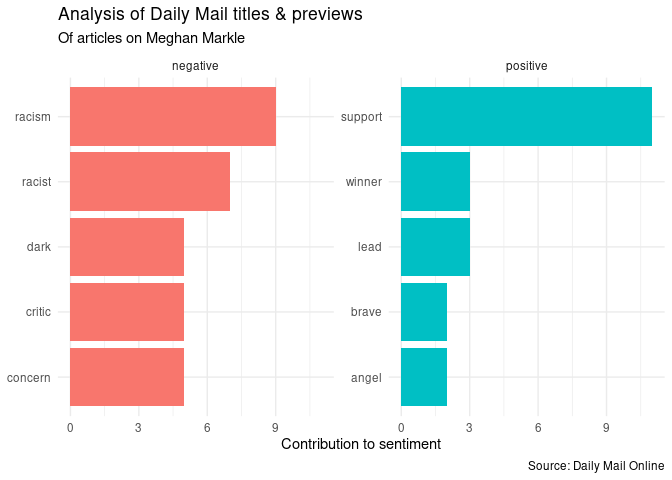
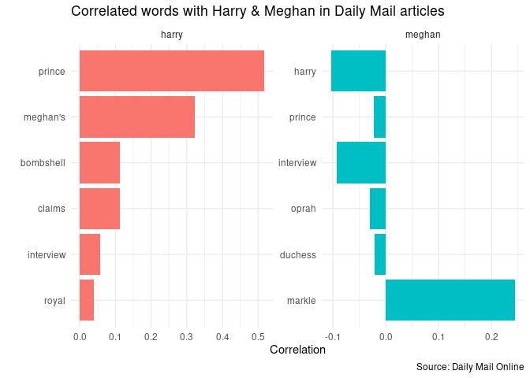

HW09: Analyzing Daily Mail coverage on Meghan Markle
================
Julia Du
2021-03-13

  - [Load necessary libraries](#load-necessary-libraries)
  - [Overview](#overview)
  - [Getting & cleaning data](#getting--cleaning-data)
  - [Looking at word frequency](#looking-at-word-frequency)
  - [Sentiment analysis](#sentiment-analysis)
  - [Pairwise correlation](#pairwise-correlation)
  - [Topic modeling (Latent Dirichlet
    allocation)](#topic-modeling-latent-dirichlet-allocation)
  - [Session info](#session-info)

## Load necessary libraries

``` r
library(tidyverse)
library(stringr)
library(glue)

library(tidytext)
#library(tokenizers) # not used this time around
library(SnowballC)
library(reshape2)
library(wordcloud)
library(widyr)
library(ggraph)
library(igraph)

library(textrecipes)
library(topicmodels)

theme_set(theme_minimal())
set.seed(123)
```

## Overview

Meghan Markle has been in headlines lately because she and Prince Harry
sat down with Oprah Winfrey for an interview, detailing the factors
behind their departure from the British royal family. To oversimplify,
one key factor was the racist coverage Meghan received in British
tabloids like the *Daily Mail* (examples
[here](https://www.buzzfeednews.com/article/ellievhall/meghan-markle-kate-middleton-double-standards-royal)).
I wanted to use text analysis to explore how she was covered in recent
*Daily Mail* articles.

My analysis draws heavily from examples in [*Text Mining with
R*](https://www.tidytextmining.com/) and our [class
notes](https://cfss.uchicago.edu/syllabus/text-analysis-fundamentals-and-sentiment-analysis/).

## Getting & cleaning data

You’ll need to first run the [data\_hw09.R](data_hw09.R) script to
scrape data from the *Daily Mail* website. I created this scraping
script outside of my hw09.Rmd file because the Daily Mail updates
frequently, and I don’t want to knit my .Rmd & end up running the
scraping code (& thereby getting a totally different list of articles).

However, I’ve included a local copy of the dataset I was working with
(**the “.data/mail\_210310.6pm.csv” file**) and if you clone my repo,
you shouldn’t need to run the script. You’ll be able to replicate my
results using this .Rmd alone. (And if you do run the scraping R script,
you’ll get different results since the website has updated since I
collect my data.)

I scraped the 80 article titles and previews (1st sentence of the
article) available on Daily Mail’s dedicated Meghan Markle index page on
Mar. 10, 2021 around 6pm CT.

``` r
# read in local copy of scraped data
almost_mail <- read_csv("./data/mail_210310.6pm.csv")

tidy_mail <- almost_mail %>%
  filter(!(. =="")) %>% # removing blank rows from all article columns - based on original scraped df
# when using a df that was read-in as a csv, could just do "drop_na()" instead of filter
  mutate(id = c("title", "date", "preview"), .before = 1) %>%
# could use transpose here instead of pivot commands below (just t() & then as_tibble() in pipe)
  pivot_longer(-id, names_to = "recent_order", values_to = "values") %>%
  pivot_wider(names_from = id, values_from = values)
```

After starting my text analysis, it became clear that I didn’t have
enough text data to draw significant conclusions. I considered also
scraping the individual articles by using the list of article titles I
had initially scraped, but the newspaper article URLs on the Daily Mail
have an identifier \# alongside the article title (for example, the
bolded region in this URL
<https://www.dailymail.co.uk/news/>**article-9354687**/Piers-Morgan-slams-bullies-chat-Talk-shaming-Sharon-Osbourne.html).
Thus, it was difficult to iterate a scraping process for a specified
list of articles.

I ended up continuing my text analysis with what I had, but it was
helpful to remember that any techniques I used were limited in their
effectiveness, given the dearth of data available.

## Looking at word frequency

I decided to first check out the frequency of words in my data.

``` r
combined_word <- tidy_mail %>%
  unite(col = combined_text, title, preview, sep = ". ") %>% 
  #join title & preview columns 
  unnest_tokens(output = word, input = combined_text) %>%
  anti_join(stop_words) 

# word frequency
combined_word %>%
  count(word, sort = TRUE)
```

    ## # A tibble: 1,200 x 2
    ##    word          n
    ##    <chr>     <int>
    ##  1 meghan       87
    ##  2 harry        55
    ##  3 interview    55
    ##  4 oprah        49
    ##  5 prince       48
    ##  6 royal        32
    ##  7 markle       29
    ##  8 meghan's     25
    ##  9 family       23
    ## 10 duchess      22
    ## # … with 1,190 more rows

``` r
#trying stem 
stem_combined_word <- tidy_mail %>%
  unite(col = combined_text, title, preview, sep = ". ") %>% 
  unnest_tokens(output = word, input = combined_text) %>%
  anti_join(stop_words) %>%
  mutate(word = wordStem(word)) #stemming words

# further cleaning up words by removing common stems
common_stem <- c(
  "meghan", "harri", "oprah", "interview", "markl", "meghan'", "princ", "royal")

stem_combined_word %>%
  filter(!word %in% common_stem) %>%
  count(word, sort = TRUE) %>%
  filter(n > 10) %>%
  knitr::kable(
    caption = "Frequent word stems in Daily Mail coverage", 
    col.names = c(
      "Word",
      "Count"))
```

| Word     | Count |
| :------- | ----: |
| claim    |    35 |
| famili   |    23 |
| duchess  |    22 |
| bombshel |    20 |
| markle’  |    18 |
| sussex   |    18 |
| morgan   |    16 |
| queen    |    16 |
| host     |    15 |
| winfrei  |    15 |
| pier     |    14 |
| duke     |    12 |
| skin     |    12 |
| support  |    11 |

Frequent word stems in Daily Mail coverage

As expected, simply finding the most frequently used words wasn’t super
illuminating since I was looking at only article titles and previews,
i.e. the first things a reader sees that indicates what the article is
about - so most articles would obviously mention Meghan Markle, Prince
Harry, and their recent interview with Oprah.

Then, I tried stemming the data (i.e. reducing words to a single
stem/root) and then removing the stem form of these common names to see
if I could get a better sense of what the Daily Mail was actually
*saying* about Meghan Markle, but the limited data also hindered the
effectiveness. Beyond the common words used to refer to the royal
family, we do see that **skin** was a common word, indicating that the
story of a royal family member asking about Archie’s skin color was
quite notable.

I tried using both non-stemmed and stemmed data for the following text
analyses and found that the stemmed data seemed to give more informative
results (i.e. less repetitive info) for sentiment analysis. In all other
following analyses, I settled upon using non-stemmed data for my final
knitted doc. I’d probably be able to better assess the efficacy of
non-stemmed vs stemmed data if, as noted earlier, I had more data to
analyze.

## Sentiment analysis

I then attempted to look at the sentiment of the coverage of Meghan
Markle.

``` r
bing_word <- stem_combined_word %>%
  inner_join(get_sentiments("bing")) %>%
  count(word, sentiment, sort = TRUE) 

bing_word %>%
  group_by(sentiment) %>%
  slice_head(n = 5) %>%
  ungroup() %>%
  mutate(word = as_factor(word), word = fct_reorder(word, n)) %>%
  ggplot(aes(n, word, fill = sentiment)) +
  geom_col(show.legend = FALSE) +
  facet_wrap(~sentiment, scales = "free_y") +
  labs(title = "Analysis of Daily Mail titles & previews",
       subtitle = "Of articles on Meghan Markle", 
       x = "Contribution to sentiment",
       y = NULL,
       caption = "Source: Daily Mail Online")
```

<!-- -->

``` r
stem_combined_word %>%
  inner_join(get_sentiments("bing")) %>%
  count(word, sentiment, sort = TRUE) %>%
  acast(word ~ sentiment, value.var = "n", fill = 0) %>%
  # color reference: http://www.stat.columbia.edu/~tzheng/files/Rcolor.pdf
  comparison.cloud(colors = c("tomato", "cadetblue1"), 
                   max.words = 30, title.bg.colors = c("tomato", "cadetblue1")) 
```

<!-- -->

From both the bar graph and word cloud, we can see that the primary
negative words referred to the racism and criticism that Markle faced.
The most common positive word, support, likely referred to the general
support that Markle received for her openness in the Oprah interview.

This of course doesn’t help us to really understand the Daily Mail’s
coverage of Markle. Even a cursory scan of its headlines indicate that
the tabloid was rather skeptical and dismissive of Markle. This problem
can largely be attributed to the small amount of data available.

## Pairwise correlation

I then tried to find words correlated with Meghan and Harry to get an
idea of how the Daily Mail described them.

``` r
word_cors <- combined_word %>%
  group_by(word) %>%
  filter(n() >= 20) %>%
  pairwise_cor(item = word, feature = recent_order, sort = TRUE)
# looking at the common pairs of words co-appearing w/in each article 
# (as defined by recent_order)

word_cors %>%
  filter(item1 %in% c("meghan", "harry")) %>%
  group_by(item1) %>%
  mutate(item2 = as_factor(item2), item2 = fct_reorder(item2, correlation)) %>%
  slice_head(n = 6) %>%
  ungroup() %>%
  ggplot(mapping = aes(x = item2, y = correlation, fill = item1)) +
  geom_col() +
  facet_wrap(~ item1, scales = "free") +
  coord_flip() +
  labs(title = "Correlated words with Harry & Meghan in Daily Mail articles", 
       y = "Correlation", x = "", caption = "Source: Daily Mail Online") +
  theme(legend.position = "none")
```

<!-- -->

``` r
word_cors %>%
  filter(correlation > .1) %>%
  graph_from_data_frame() %>%
  ggraph(layout = "fr") +
  geom_edge_link(aes(edge_alpha = correlation), show.legend = FALSE) +
  geom_node_point(color = "lightblue", size = 5) +
  geom_node_text(aes(label = name), repel = TRUE) +
  ggtitle("Word pairs with at least a correlation of .1 
          \nappearing in same Daily Mail article")
```

<!-- -->

This technique also wasn’t very helpful. The bar graph just tells us
that, unsurprisingly, “Meghan” is correlated with “Markle.” We also see
negatively correlated terms, which indicates that if “Meghan” shows up
in one article title/preview, a word like “prince” is more **unlikely**
to show up. This is probably because of the brevity of our observations
- if Meghan was already mentioned in an article’s title, that’s just
less space to mention Prince Harry (and there likely isn’t a need to
mention Meghan’s spouse as well, since the audience presumably already
knows they’re a couple). The word cluster tells us similar things and
seems like it’d be more helpful with more data. As represented by bold
black lines, it correctly identified that Meghan Markle, Prince Harry,
the royal family, and Oprah interview were common pairs in the articles
scraped.

## Topic modeling (Latent Dirichlet allocation)

Finally, I tried to see what potential topics the Daily Mail coverage on
Markle could center on through Latent Dirichlet allocation (LDA).

``` r
mail_rec <- recipe(~., data = combined_word) %>%
  step_tokenize(word) %>% # this tells R word is a token list
  step_ngram(word, num_tokens = 3, min_num_tokens = 1) %>%
  step_tokenfilter(word, max_tokens = 2000) %>%
  step_tf(word)

mail_prep <- prep(mail_rec)

mail_df <- bake(mail_prep, new_data = NULL) %>%
  select(-date) 

#convert to Document Term Matrix
mail_dtm <- mail_df %>%
  pivot_longer(cols = -c(recent_order),
               names_to = "token",
               values_to = "n") %>%
  filter(n != 0) %>%
  mutate(token = str_remove(string = token, pattern = "tf_word_"),
         recent_order = fct_drop(f = recent_order)) %>%
  cast_dtm(document = recent_order, term = token, value = n)

mail_lda4 <- LDA(mail_dtm, k = 6, control = list(seed = 123))

top_terms_lda4 <- mail_lda4 %>%
  tidy() %>%
  group_by(topic) %>%
  slice_max(n = 5, order_by = beta, with_ties = FALSE) %>% 
  # so it doesn't return all ties
  ungroup() %>%
  arrange(topic, -beta)

top_terms_lda4 %>%
  mutate(topic = as_factor(topic),
         term = reorder_within(term, beta, topic)) %>%
  ggplot(aes(term, beta, fill = topic)) +
  geom_col(alpha = 0.8) +
  scale_x_reordered() +
  facet_wrap(~ topic, scales = "free", ncol = 3) +
  coord_flip() +
  theme(text = element_text(size = 10), legend.position = "") +
  labs(title = "Topics of Daily Mail articles generated by LDA", x = "",
       caption = "Source: Daily Mail Online")
```

<!-- -->

Ideally, trying topic classification here would give us an idea of the
general content in the articles, but there is not data for this to
helpful. The topics all look pretty similar, referencing Meghan Markle,
Prince Harry, Oprah’s interview, and the royal family. We’re very
limited in what we can do with just the title and 1st sentence of an
article; no meaningful conclusions can be drawn.

In the future, such a text analysis would definitely require more data,
but this was a good exercise in practicing the techniques.

## Session info

``` r
devtools::session_info()
```

    ## ─ Session info ───────────────────────────────────────────────────────────────
    ##  setting  value                               
    ##  version  R version 4.0.1 (2020-06-06)        
    ##  os       Red Hat Enterprise Linux 8.3 (Ootpa)
    ##  system   x86_64, linux-gnu                   
    ##  ui       X11                                 
    ##  language (EN)                                
    ##  collate  en_US.UTF-8                         
    ##  ctype    en_US.UTF-8                         
    ##  tz       America/Chicago                     
    ##  date     2021-03-13                          
    ## 
    ## ─ Packages ───────────────────────────────────────────────────────────────────
    ##  package      * version    date       lib source        
    ##  assertthat     0.2.1      2019-03-21 [2] CRAN (R 4.0.1)
    ##  backports      1.2.1      2020-12-09 [2] CRAN (R 4.0.1)
    ##  broom          0.7.3      2020-12-16 [2] CRAN (R 4.0.1)
    ##  callr          3.5.1      2020-10-13 [2] CRAN (R 4.0.1)
    ##  cellranger     1.1.0      2016-07-27 [2] CRAN (R 4.0.1)
    ##  class          7.3-17     2020-04-26 [2] CRAN (R 4.0.1)
    ##  cli            2.2.0      2020-11-20 [2] CRAN (R 4.0.1)
    ##  colorspace     2.0-0      2020-11-11 [2] CRAN (R 4.0.1)
    ##  crayon         1.3.4      2017-09-16 [2] CRAN (R 4.0.1)
    ##  DBI            1.1.0      2019-12-15 [2] CRAN (R 4.0.1)
    ##  dbplyr         2.0.0      2020-11-03 [2] CRAN (R 4.0.1)
    ##  desc           1.2.0      2018-05-01 [2] CRAN (R 4.0.1)
    ##  devtools       2.3.2      2020-09-18 [1] CRAN (R 4.0.1)
    ##  digest         0.6.27     2020-10-24 [2] CRAN (R 4.0.1)
    ##  dplyr        * 1.0.2      2020-08-18 [2] CRAN (R 4.0.1)
    ##  ellipsis       0.3.1      2020-05-15 [2] CRAN (R 4.0.1)
    ##  evaluate       0.14       2019-05-28 [2] CRAN (R 4.0.1)
    ##  fansi          0.4.1      2020-01-08 [2] CRAN (R 4.0.1)
    ##  farver         2.0.3      2020-01-16 [2] CRAN (R 4.0.1)
    ##  forcats      * 0.5.0      2020-03-01 [2] CRAN (R 4.0.1)
    ##  fs             1.5.0      2020-07-31 [2] CRAN (R 4.0.1)
    ##  generics       0.1.0      2020-10-31 [2] CRAN (R 4.0.1)
    ##  ggforce        0.3.2      2020-06-23 [2] CRAN (R 4.0.1)
    ##  ggplot2      * 3.3.3      2020-12-30 [2] CRAN (R 4.0.1)
    ##  ggraph       * 2.0.4      2020-11-16 [2] CRAN (R 4.0.1)
    ##  ggrepel        0.9.0      2020-12-16 [2] CRAN (R 4.0.1)
    ##  glue         * 1.4.2      2020-08-27 [2] CRAN (R 4.0.1)
    ##  gower          0.2.2      2020-06-23 [2] CRAN (R 4.0.1)
    ##  graphlayouts   0.7.1      2020-10-26 [2] CRAN (R 4.0.1)
    ##  gridExtra      2.3        2017-09-09 [2] CRAN (R 4.0.1)
    ##  gtable         0.3.0      2019-03-25 [2] CRAN (R 4.0.1)
    ##  haven          2.3.1      2020-06-01 [2] CRAN (R 4.0.1)
    ##  highr          0.8        2019-03-20 [2] CRAN (R 4.0.1)
    ##  hms            0.5.3      2020-01-08 [2] CRAN (R 4.0.1)
    ##  htmltools      0.5.1.1    2021-01-22 [1] CRAN (R 4.0.1)
    ##  httr           1.4.2      2020-07-20 [2] CRAN (R 4.0.1)
    ##  igraph       * 1.2.6      2020-10-06 [2] CRAN (R 4.0.1)
    ##  ipred          0.9-9      2019-04-28 [2] CRAN (R 4.0.1)
    ##  janeaustenr    0.1.5      2017-06-10 [2] CRAN (R 4.0.1)
    ##  jsonlite       1.7.2      2020-12-09 [2] CRAN (R 4.0.1)
    ##  knitr          1.30       2020-09-22 [2] CRAN (R 4.0.1)
    ##  labeling       0.4.2      2020-10-20 [2] CRAN (R 4.0.1)
    ##  lattice        0.20-41    2020-04-02 [2] CRAN (R 4.0.1)
    ##  lava           1.6.8.1    2020-11-04 [2] CRAN (R 4.0.1)
    ##  lifecycle      0.2.0      2020-03-06 [2] CRAN (R 4.0.1)
    ##  lubridate      1.7.9.2    2020-11-13 [2] CRAN (R 4.0.1)
    ##  magrittr       2.0.1      2020-11-17 [2] CRAN (R 4.0.1)
    ##  MASS           7.3-51.6   2020-04-26 [2] CRAN (R 4.0.1)
    ##  Matrix         1.2-18     2019-11-27 [2] CRAN (R 4.0.1)
    ##  memoise        1.1.0      2017-04-21 [2] CRAN (R 4.0.1)
    ##  modelr         0.1.8      2020-05-19 [2] CRAN (R 4.0.1)
    ##  modeltools     0.2-23     2020-03-05 [2] CRAN (R 4.0.1)
    ##  munsell        0.5.0      2018-06-12 [2] CRAN (R 4.0.1)
    ##  NLP            0.2-1      2020-10-14 [2] CRAN (R 4.0.1)
    ##  nnet           7.3-14     2020-04-26 [2] CRAN (R 4.0.1)
    ##  pillar         1.4.7      2020-11-20 [2] CRAN (R 4.0.1)
    ##  pkgbuild       1.2.0      2020-12-15 [2] CRAN (R 4.0.1)
    ##  pkgconfig      2.0.3      2019-09-22 [2] CRAN (R 4.0.1)
    ##  pkgload        1.1.0      2020-05-29 [2] CRAN (R 4.0.1)
    ##  plyr           1.8.6      2020-03-03 [2] CRAN (R 4.0.1)
    ##  polyclip       1.10-0     2019-03-14 [2] CRAN (R 4.0.1)
    ##  prettyunits    1.1.1      2020-01-24 [2] CRAN (R 4.0.1)
    ##  processx       3.4.5      2020-11-30 [2] CRAN (R 4.0.1)
    ##  prodlim        2019.11.13 2019-11-17 [2] CRAN (R 4.0.1)
    ##  ps             1.5.0      2020-12-05 [2] CRAN (R 4.0.1)
    ##  purrr        * 0.3.4      2020-04-17 [2] CRAN (R 4.0.1)
    ##  R6             2.5.0      2020-10-28 [2] CRAN (R 4.0.1)
    ##  RColorBrewer * 1.1-2      2014-12-07 [2] CRAN (R 4.0.1)
    ##  Rcpp           1.0.5      2020-07-06 [2] CRAN (R 4.0.1)
    ##  readr        * 1.4.0      2020-10-05 [2] CRAN (R 4.0.1)
    ##  readxl         1.3.1      2019-03-13 [2] CRAN (R 4.0.1)
    ##  recipes      * 0.1.15     2020-11-11 [2] CRAN (R 4.0.1)
    ##  remotes        2.2.0      2020-07-21 [2] CRAN (R 4.0.1)
    ##  reprex         0.3.0      2019-05-16 [1] CRAN (R 4.0.1)
    ##  reshape2     * 1.4.4      2020-04-09 [2] CRAN (R 4.0.1)
    ##  rlang          0.4.10     2020-12-30 [2] CRAN (R 4.0.1)
    ##  rmarkdown      2.7        2021-02-19 [1] CRAN (R 4.0.1)
    ##  rpart          4.1-15     2019-04-12 [2] CRAN (R 4.0.1)
    ##  rprojroot      2.0.2      2020-11-15 [2] CRAN (R 4.0.1)
    ##  rstudioapi     0.13       2020-11-12 [2] CRAN (R 4.0.1)
    ##  rvest          0.3.6      2020-07-25 [2] CRAN (R 4.0.1)
    ##  scales         1.1.1      2020-05-11 [2] CRAN (R 4.0.1)
    ##  sessioninfo    1.1.1      2018-11-05 [2] CRAN (R 4.0.1)
    ##  slam           0.1-48     2020-12-03 [2] CRAN (R 4.0.1)
    ##  SnowballC    * 0.7.0      2020-04-01 [2] CRAN (R 4.0.1)
    ##  stringi        1.5.3      2020-09-09 [2] CRAN (R 4.0.1)
    ##  stringr      * 1.4.0      2019-02-10 [2] CRAN (R 4.0.1)
    ##  survival       3.1-12     2020-04-10 [2] CRAN (R 4.0.1)
    ##  testthat       3.0.1      2020-12-17 [2] CRAN (R 4.0.1)
    ##  textrecipes  * 0.4.0      2020-11-12 [1] CRAN (R 4.0.1)
    ##  tibble       * 3.0.4      2020-10-12 [2] CRAN (R 4.0.1)
    ##  tidygraph      1.2.0      2020-05-12 [2] CRAN (R 4.0.1)
    ##  tidyr        * 1.1.2      2020-08-27 [2] CRAN (R 4.0.1)
    ##  tidyselect     1.1.0      2020-05-11 [2] CRAN (R 4.0.1)
    ##  tidytext     * 0.2.6      2020-09-20 [2] CRAN (R 4.0.1)
    ##  tidyverse    * 1.3.0      2019-11-21 [1] CRAN (R 4.0.1)
    ##  timeDate       3043.102   2018-02-21 [2] CRAN (R 4.0.1)
    ##  tm             0.7-8      2020-11-18 [2] CRAN (R 4.0.1)
    ##  tokenizers     0.2.1      2018-03-29 [2] CRAN (R 4.0.1)
    ##  topicmodels  * 0.2-11     2020-04-19 [2] CRAN (R 4.0.1)
    ##  tweenr         1.0.1      2018-12-14 [2] CRAN (R 4.0.1)
    ##  usethis        2.0.0      2020-12-10 [1] CRAN (R 4.0.1)
    ##  utf8           1.1.4      2018-05-24 [2] CRAN (R 4.0.1)
    ##  vctrs          0.3.6      2020-12-17 [2] CRAN (R 4.0.1)
    ##  viridis        0.5.1      2018-03-29 [1] CRAN (R 4.0.1)
    ##  viridisLite    0.3.0      2018-02-01 [2] CRAN (R 4.0.1)
    ##  widyr        * 0.1.3      2020-04-12 [2] CRAN (R 4.0.1)
    ##  withr          2.3.0      2020-09-22 [2] CRAN (R 4.0.1)
    ##  wordcloud    * 2.6        2018-08-24 [2] CRAN (R 4.0.1)
    ##  xfun           0.19       2020-10-30 [2] CRAN (R 4.0.1)
    ##  xml2           1.3.2      2020-04-23 [2] CRAN (R 4.0.1)
    ##  yaml           2.2.1      2020-02-01 [2] CRAN (R 4.0.1)
    ## 
    ## [1] /home/duj/R/x86_64-pc-linux-gnu-library/4.0
    ## [2] /opt/R/4.0.1/lib/R/library
